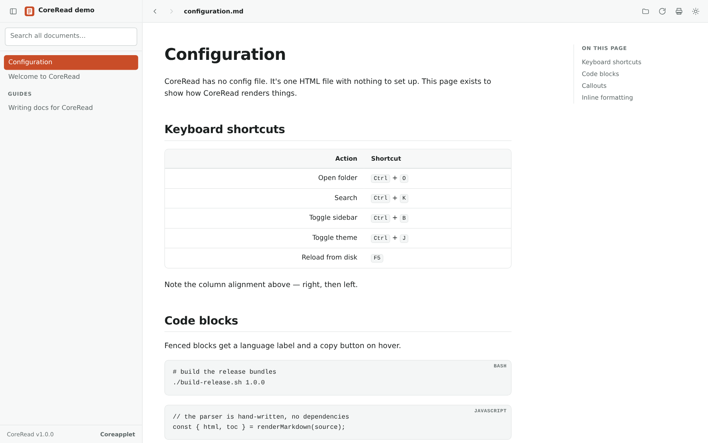
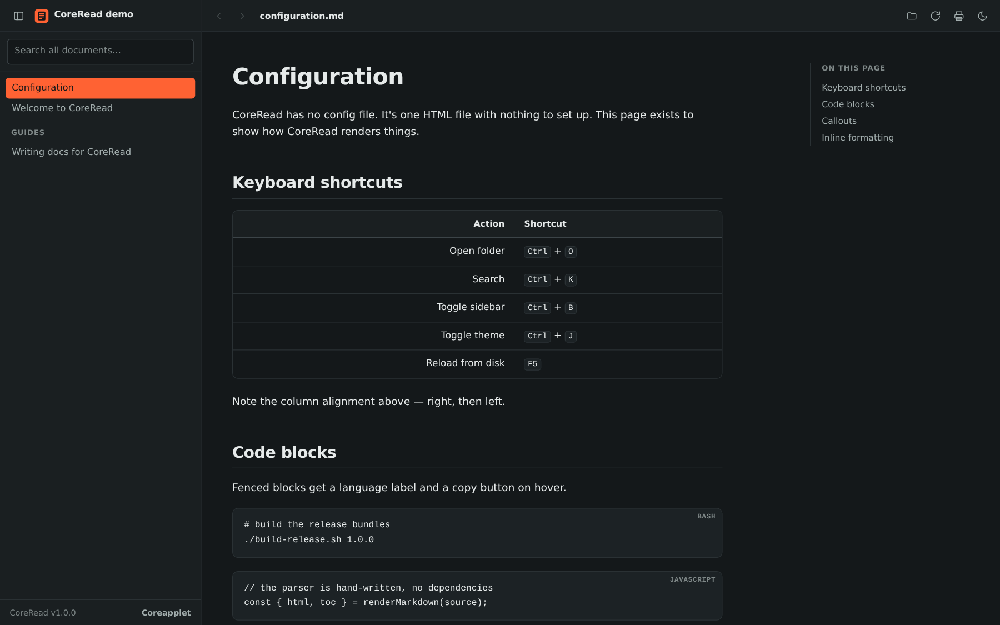

<div align="center">

# CoreRead

**A Markdown reader in a single HTML file.**

No install. No dependencies. No third-party code. 93 KB.

[**Try it live**](https://coreapplet.github.io/coreread/#demo) · [Get it](#get-it) · [Features](#what-it-handles) · [Why](#why-this-exists) · [Coreapplet](https://www.coreapplet.com)



</div>

---

Point CoreRead at a folder of Markdown files and read them the way they were meant to be read — sidebar, table of contents, full-text search, working cross-links, real GFM tables.

It's one HTML file with a hand-written Markdown parser. No CDN, no bundler, no `node_modules`, nothing to `npm install`, no telemetry, no analytics. Open it on a plane.

<div align="center">

</div>

---

## Get it

### Install as an app — easiest

No download, no security warning, and you get a proper icon.

1. Open [the hosted version](https://coreapplet.github.io/coreread/) in Chrome or Edge
2. Click the **install icon** in the address bar, or **⋯ → Apps → Install this site as an app**
3. CoreRead appears in your Start menu, Dock or launcher, opens in its own window, and can be pinned

It works offline after the first launch — a service worker caches the app, so it opens with no connection at all.

On Android the same page offers **Add to Home screen**. On iOS use Share → **Add to Home Screen**; it renders fine, though mobile browsers can't open folders.

### Download the file

Grab `CoreRead.html` from the [latest release](../../releases/latest) and open it in any Chromium browser. One file, works offline, nothing to install. Put it on a USB stick if you like.

### Download with a launcher

If you want the chromeless window locally, the [release](../../releases/latest) also has per-platform bundles:

| Platform | Download | Run |
|---|---|---|
| **Windows** | `coreread-windows.zip` | Double-click `CoreRead.vbs` |
| **macOS** | `coreread-macos.zip` | Right-click `CoreRead.command` → **Open** |
| **Linux** | `coreread-linux.zip` | `chmod +x CoreRead.sh` then run it |

Each launcher opens CoreRead in a window with no address bar and no tabs, with its own taskbar or Dock entry.

### First run

Your OS warns you once, because the launchers aren't code-signed.

**Windows** shows *"Open File — Security Warning"* with **Publisher: Unknown Publisher**. Click **Open**.

This appears because Windows marks everything downloaded from the internet, and that mark carries over to files extracted from a zip. To stop it appearing again, right-click `CoreRead.vbs` → **Properties** → tick **Unblock** → **OK**.

**macOS** blocks it with *"cannot be opened because the developer cannot be verified."* Right-click `CoreRead.command` → **Open** → **Open**. Double-clicking won't work the first time; the right-click menu is what offers the override.

**Linux** doesn't warn, but the file may need `chmod +x CoreRead.sh`.

None of this means the file is unsafe — it means nobody has paid a certificate authority to vouch for it. All three launchers are short, readable text scripts. Open them in a text editor first if you'd rather check what they do; each is under 50 lines and does one thing: find `CoreRead.html` next to itself and open it in your browser.

---

## Usage

Click **Open folder…** and pick any folder containing Markdown. CoreRead indexes it recursively, groups it by sub-folder in the sidebar, and remembers it for next time.

Not ready to point it at your own files? Click **Try the demo** for a built-in sample, or open [the hosted demo](https://coreapplet.github.io/coreread/#demo).

| Action | Shortcut |
|---|---|
| Open folder | `Ctrl` + `O` |
| Search all documents | `Ctrl` + `K` |
| Toggle sidebar | `Ctrl` + `B` |
| Toggle light / dark | `Ctrl` + `J` |
| Reload from disk | `F5` |
| Move between documents | `↑` / `↓` in the sidebar |
| First / last document | `Home` / `End` |
| Back / forward | `Alt` + `←` / `→` |
| Print or save as PDF | `Ctrl` + `P` |

Drag a `.md` file or a whole folder onto the window to open it.

---

## What it handles

| Feature | Notes |
|---|---|
| **Tables** | Full GFM, including column alignment |
| **Cross-links** | `[rules](../architecture/RULES.md)` resolves and navigates in-app |
| **Code blocks** | Language label, hover-to-copy button |
| **Blockquotes** | Auto-styled as warning or note callouts based on content |
| **Task lists** | `- [ ]` checkboxes; ticked state persists per document |
| **Headings** | Automatic table of contents with scroll-spy |
| **Search** | Full text across every loaded document, with snippets |
| **Nested folders** | Grouped in the sidebar, numeric sort prefixes stripped |
| **Front matter** | YAML front matter is stripped, not rendered |
| **Dark mode** | Follows your system by default, toggleable |
| **Print** | Strips all UI chrome for clean PDF output |
| **Reading position** | Each document reopens where you stopped reading |
| **Keyboard** | Fully navigable — search, arrows, Enter, no mouse needed |
| **Offline** | The installed app works with no connection |

Links whose target isn't in the loaded folder are dimmed, so a typo is visible instead of silently doing nothing.

---

## Why this exists

Markdown files are plain text. Opening one in Notepad gives you a wall of pipes and asterisks. Every good alternative asks you to install something — an editor, an app, a plugin, a toolchain.

CoreRead is the smallest thing that makes a folder of Markdown genuinely readable. It's meant for documentation that lives in a folder rather than a wiki: build guides, runbooks, internal handbooks — the kind you read in one window while working in another.

It carries no dependency chain, which felt like the right call for a tool whose entire job is being available and fast.

---

## Why does it ask for permission to "view and copy files"?

The first time you open a folder, your browser shows a dialog like this:

> **Allow this site to view and copy files?**
> `file:///` will be able to view and make its own copies of files in *YourFolder*

That's the browser, not CoreRead, and you should expect it. It's the standard [File System Access API](https://developer.mozilla.org/en-US/docs/Web/API/File_System_API) permission prompt, shown any time a page requests access to a folder.

A few things worth knowing:

- **The wording is the browser's, and it's deliberately broad.** "Make its own copies" is Chrome's blanket phrasing for read access. CoreRead reads your `.md` files into memory to render them. It never writes to your folder, never copies files anywhere, and never uploads anything. You can confirm this: open `CoreRead.html` in a text editor and search for `fetch`, `XMLHttpRequest` or `sendBeacon`. There are none.
- **It says `file:///` because you opened it from disk.** Local files have no domain, so the browser shows the protocol instead. Running it from the [hosted demo](https://coreapplet.github.io/coreread/#demo) shows a normal domain name.
- **It's scoped to the one folder you picked.** Nothing outside it is accessible.
- **You can revoke it any time** in Chrome or Edge under Settings → Privacy and security → Site settings → File editing.

Seeing the prompt means the browser sandbox is doing its job. An app that read your files without asking would be the thing to worry about.

If you'd rather not grant it, drag a `.md` file onto the window instead — dragging doesn't require the permission, though you lose folder memory and `F5` reload.

---

## Notes

- **`F5` re-reads from disk.** Use it after editing a doc — no restart needed.
- **Nothing is written to your documents.** Theme and checkbox state live in browser local storage. Clearing browser data resets them.
- **Folder access** uses the File System Access API where available, falling back to a standard folder input. Both work offline.
- **Why it sometimes asks for the folder again.** Browsers can downgrade a stored folder permission back to "ask" after a restart. That re-request must come from a click, so CoreRead shows a one-click **Reopen** button. This is a browser security rule — no app running in a browser engine can opt out of it.
- **Reading positions** are remembered per document, in browser storage. Nothing is written to your folder.
- **Offline** applies to the installed app. The downloadable file needs no network at all, ever.
- **The only request CoreRead ever makes** is the hosted version registering its own `sw.js`, same-origin, so it can work offline. Opened from disk it skips that entirely — check the Network tab and you'll see nothing.
- Only Markdown is indexed: `.md`, `.markdown`, `.mdown`, `.mkd`, `.txt`.

---

## Browser support

Needs a Chromium browser — Chrome, Edge, Brave, Vivaldi, or Chromium. Firefox and Safari don't implement the File System Access API, so folder opening won't work there.

---

## Building a release

```bash
./build-release.sh 1.0.0
```

Produces `coreread-windows.zip`, `coreread-macos.zip` and `coreread-linux.zip` in `dist/`. Pushing a `v*` tag runs this automatically via GitHub Actions and attaches the bundles to the release.

---

## Testing

`node tests/verify.js` needs nothing installed. See [`TESTING.md`](TESTING.md) for the full suite and the manual checklist.

---

## Contributing

Issues and pull requests welcome. CoreRead is deliberately one file — changes that introduce a build step, a dependency, or a second source file are unlikely to be merged.

---

## Credits

Built and maintained by **[Coreapplet](https://www.coreapplet.com)** — a web engineering and performance agency working on high-performance WordPress, custom e-commerce, and digital marketing.

- **USA** — [coreapplet.com](https://www.coreapplet.com)
- **UAE & GCC** — [coreapplet.ae](https://www.coreapplet.ae)

CoreRead started as an internal tool for reading our own design-system documentation, and turned out to be useful enough to share.

---

## License

[MIT](LICENSE) © [Coreapplet](https://www.coreapplet.com) — use it, fork it, ship it in your own products.
